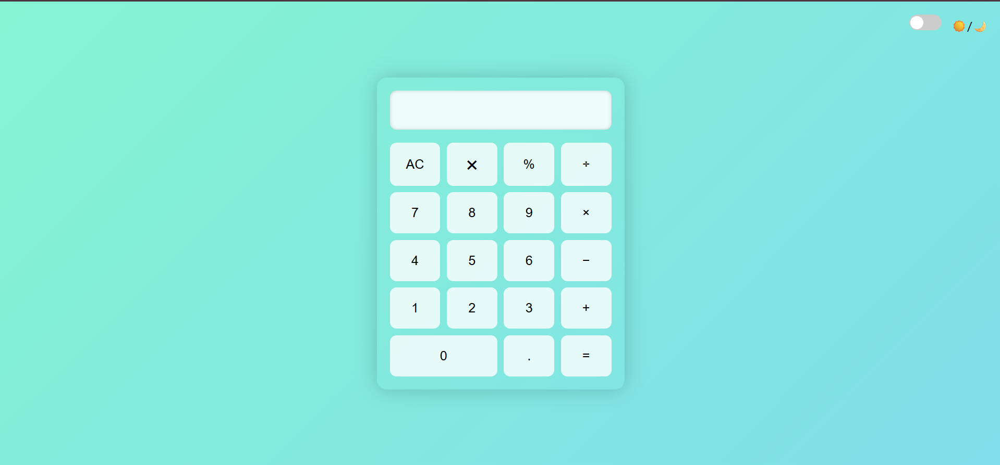

# 🌗 Gradient Calculator Web App

A sleek, responsive **Calculator Web Application** built using **HTML**, **CSS**, and **JavaScript**. This project features a beautiful **linear gradient light/dark mode toggle**, basic arithmetic operations, percentage calculations, button **sound effects**, and full **keyboard input support** Creating a basic calculator to do basic arithmetic operations. Using HTML, CSS, JS..

---

## 🔮 Features

- 🎨 **Light & Dark Themes** with smooth linear gradients
- 🧮 Basic operations: `+`, `−`, `×`, `÷`, `.`, `%`
- 🌗 **Theme toggle** (☀️ Light ↔ 🌙 Dark)
- 🔊 Button **click sound effects**
- ❌ **Clear all** function (`AC` and ✖)
- ⌨️ **Keyboard support** for all inputs
- 📱 Fully **responsive design** for mobile and desktop

---

## 🔗 Live Preview

👉 [Click to open the calculator](https://htmlpreview.github.io/?https://github.com/sohom09/calculator/blob/main/index.html)

---

## 🖼️ Screenshots

| Light Mode | Dark Mode |
|------------|-----------|
|  |  |

---

## 📂 Project Structure
    - 📁 calculator-gradient-theme/
        ├── index.html # HTML layout and structure
        ├── style.css # Linear gradient themes, layout, responsiveness
        ├── script.js # Logic, sound, toggle, keyboard input
        ├── click.mp3 # Button click sound effect
        └── README.md # Project documentation
---

## 🚀 How to Run Locally

1. **Clone the repository**  
   ```bash
   git clone https://github.com/sohom09/calculator.git

## 2. Navigate to the project folder
    ```bash
    cd calculator-gradient-theme

## 3. Open index.html in your browser.

### 🛠️ Tech Stack
    - HTML5 – Markup structure
    - CSS3 – Styling, linear gradients, responsive design
    - JavaScript (Vanilla) – Calculator logic, DOM interaction, sound effects

### 📌 Notes
    - The % button divides the current value by 100.
    - The × icon acts as a visual "Clear All" (same as AC).
    - eval() is used for expression evaluation — secure for local projects, but not recommended in production apps.

### 💡 Future Enhancements
🧠 Calculation history

📐 Scientific calculator mode (sin, cos, log, etc.)

💾 Remember theme preference using localStorage

### 🤝 Contribution
Feel free to fork the repo, submit pull requests, or suggest features!

### 📜 License
This project is open-source and available under the MIT License.

### 👤 Author
- Developed by Sohom Chakraborty

### 🔗 GitHub Profile
